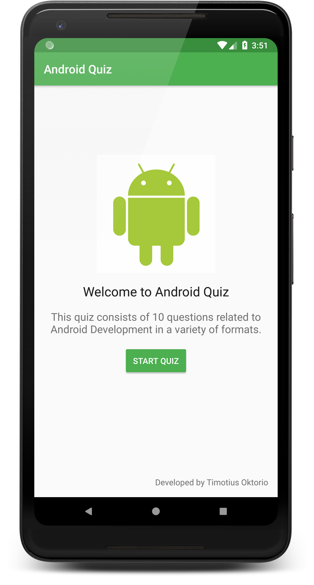
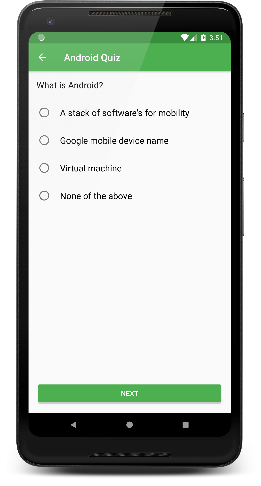

# Quiz App

**Platform: Android (Min SDK: 19, Target SDK: 27)**

**Author: [Timotius Oktorio](https://ca.linkedin.com/in/timotiusoktorio "LinkedIn Profile") (toktorio@gmail.com)**

Simple quiz game app about Android development which consists of 10 questions in a variety of formats.

*This app is created as the third project of [Android Basics Nanodegree](https://www.udacity.com/course/android-basics-nanodegree-by-google--nd803) program at Udacity.*

### Features
- Test your Android development knowledge by taking this short quiz.
- Lightweight app with no network calls which allows the quiz to be done offline.
- Design support for both portrait and landscape orientation.

### What I have learned from this project
- Planning an app design before writing code.
- Taking an app layout from drawing to XML code.
- Creating, positioning, and styling views.
- Creating interactivity through button clicks and Java code.
- Commenting and documenting code.

  

Get the apk file [here](https://github.com/toktorio/Quiz-App/blob/master/app/release/quiz-app.apk?raw=true) to install the app on your device. Note that depending on your device settings, you might need to allow installation from unknown sources in order to install this app. Visit this [link](https://www.androidcentral.com/unknown-sources) for the detailed instructions.